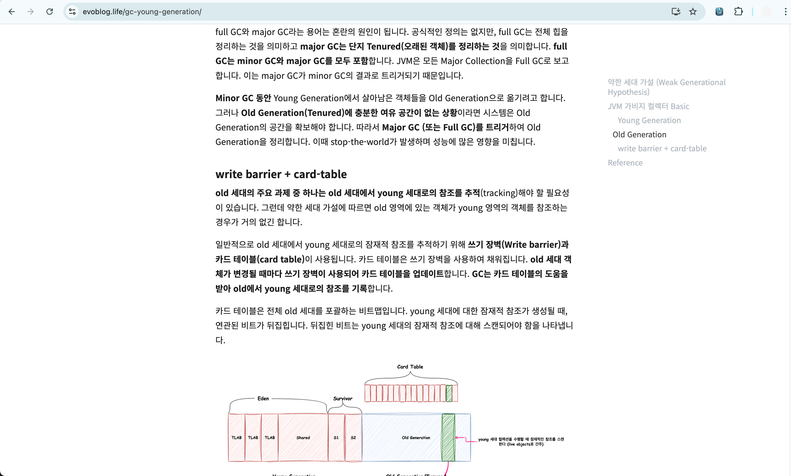

### 6개월간의 취준 끝.

2024년 8월 초부터 12월까지 flab 멘토링을 들은 후, 4월까지 취준을 마치고 원하는 조건들을 갖춘 서비스회사에 인턴을 시작했다.
flab이 개발 방향을 잡는데에 가장 큰 역할을 했기에, 오랜만에 회고를 해보려한다.

### 멘토링을 시작하게 된 계기

나는 예전부터 멘토링 방식의 학습을 선호해왔다. 학교 멘토링 프로그램이나 개인적으로 구한 1:1 멘토링을 통해 객관적인 피드백을 받고 성장한 경험이 있었다. 

단기간에 압축적인 성장을 원했기에, 체계적인 커리큘럼과 나와 맞는 선별된 멘토를 매칭받을 수 있는 F-LAB을 선택하게 되었다.

### 현재까지 무엇을 배웠는가

<b>1. 질문 중심의 깊이 있는 학습 방법</b>

멘토링 초반부터 현재까지 기본기를 쌓는 데 집중하고 있다.

멘토링 초기에는 약 3주 동안 매주 자바 학습에 집중했다. 
멘토님께 질문을 받으면서 답변의 부족한 부분을 보완하고, 예상치 못한 꼬리질문과 새로운 인사이트를 얻었다. 
이를 바탕으로 다시 공부하며 고민의 깊이를 늘려가는 방식으로 진행했다.

학습 내용을 체계적으로 정리하기 위해 노션이나 깃허브를 활용했고, 깊이 있는 공부가 필요한 주제는 블로그에 작성하며 학습했다.

멘토님의 질문들과 멘토님이 초청한 면접관들과의 모의면접, 실제 면접 경험, 그리고 F-LAB 동료들과의 지속적인 모의면접을 통해 많은 데이터가 축적되었다. 

이 과정에서 모든 답변을 내 언어로 표현하려 노력한 결과, 풍부한 지식 기반을 구축할 수 있었다.

공부할 때는 지속적으로 꼬리질문을 이어나갔다. 

예를 들어, 인덱스에 관한 대표적인 질문도 아래와 같이 연쇄적인 꼬리질문으로 발전시킬 수 있었다. 혼자 학습하는 데 한계를 느꼈을 때는 멘토님이나 모의면접을 통해 부족한 부분을 보완했다.

<b>2. 학습과 프로젝트의 균형 잡기</b>

이론만 공부하면 실제 적용 목적을 이해하기 어렵다. 따라서 멘토님과 나는 초반에는 자바와 스프링 이론에 집중했지만, 이후에는 <b>하루 10시간 중 8시간은 이론, 2시간은 프로젝트로 시간을 배분</b>했다.

이 방식이 프로젝트 시간이 부족해 보일 수 있지만, 우리는 탄탄한 이론 기반 위에 실제 적용 훈련을 하는 접근법을 선호했다. 현재는 이론 6시간, 코딩테스트 2시간, 프로젝트 2시간으로 균형을 맞추고 있다.(코딩테스트는 프로젝트만으로는 실력이 향상되지 않는다..).

멘토님과 함께 프로젝트 접근 방식도 결정했다. 여러 기능을 개발하며 전체 과정을 경험할지, 아니면 하나의 기능을 깊이 파고들지 고민했다. 나는 이미 학교에서 팀 프로젝트를 통해 전체 개발 과정을 경험해봤기 때문에, <b>하나의 기능을 심도 있게 개발하는 방식을 선택</b>했다.

먼저 기획하고 구현할 기능들을 나열했다. 멘토님은 그중 하나를 선택해서 내 생각대로 구현해보라고 지시하셨다. <b>기능 구현 후에는 코드 구조와 스타일을 리뷰하고 다음 단계를 제시</b>해주셨다. 예를 들어, 구현한 기능의 성능 테스트를 진행하는 등의 과제를 주셨다.

<b>매일 슬랙을 통해 개발 과정에서 생기는 고민과 질문을 공유</b>하면 멘토님께서 적극적으로 도움을 주셨다. 성능 테스트를 통해 처음으로 TPS(초당 트랜잭션 수)가 낮다는 것을 체감했고, 내 구현 방식의 한계를 깨달았다. 멘토님은 기능 개선을 위한 힌트를 주셨고, 예를 들어 SQL EXPLAIN을 확인해보라는 조언을 받았다.

이를 통해 쿼리 실행 계획을 분석하고 추가 학습을 진행했으며, 데이터베이스 옵티마이저가 선택한 방식이 최적이 아닐 때 어떻게 개선할지 <b>고민하는 과정을 경험</b>했다.

이런 방식으로 프로젝트에서 하나의 문제를 깊이 있게 탐구하고 해결하는 접근법을 배웠다.

### 이전에 경험했던 프로젝트와 무엇들이 다른가

앞서 배운 내용과 기능 개발 접근법 훈련을 통해, 이전 캡스톤 프로젝트를 고도화해 볼 수 있었다.
기존 프로젝트에서는 단순히 주어진 요구사항에 맞춰 기능을 개발하고 다음 기능으로 넘어가는 방식으로만 진행했었다.

거기서 난 다음 플로우를 진행했다.

- 이미 구현한 기능의 문제점 파악하기
- 가상 사용자의 목표를 설정하고, 부하 테스트를 통해 목표 성능에 미달할 경우 개선 방안 고민하기
- 부하 발생 시 에러의 원인을 정확히 파악하기
- 다양한 장애 상황을 가정하고 사전 대응책 마련하기

위 플로우를 지킬려면 결국엔 기본 개념이 확실히 갖춰야하고, 추가로 더 학습할 내용들이 생긴다.
면접관들도 가장 궁금해하는 것은 기능 하나라도 제대로 만들었는지 여부이며, 이를 확인하기 위한 질문을 던진다.

예를 들면, "사용자가 10만 명이거나, 서버나 DB에 장애가 발생하거나, 트래픽이 급증할 때 어떻게 대응할 것인지",
"다른 방법도 있는데 왜 이 방법을 선택했는지" 등이다.

특히 "왜?"라는 질문을 가장 많이 받았다. 이는 개발자가 의식적으로 선택했는지, 인터넷의 정보를 단순히 따라 했는지,
GPT가 제시한 내용을 그대로 적용했는지 판단하기 위함이다.

결국 하나의 기능을 구현할 때도 다양한 기술이 존재하며, 최적의 방법을 선택하거나 트레이드오프를 고려한 의사결정이 필요하다.

### 3개월 동안 멘토링에서 어떤 것들이 좋았는가

<b>1. 스크립트</b>

매주 멘토링 대화 내용이 스크립트로 저장되어 1시간 동안 놓친 부분들을 나중에 다시 확인하고 질문들을 정리할 수 있었다.
물론 스크립트가 없어도 직접 기록할 수 있지만, 가끔 메모를 까먹거나 귀찮아질 수 있는데 자동으로 스크립트가 영구 보관된다는 점이 매우 유용했다.

<b>2. 커리큘럼</b>

사람마다 지식 수준과 상황이 다르고, 부족한 부분도 실시간으로 변한다.
멘토님은 매 세션 시작 시 내 현재 상황을 확인하고 지속적으로 체크해주셨다.
그리고 그에 맞춰 다음 주에 준비해야 할 내용을 맞춤형으로 안내해주셨다.

특히 감사했던 점은 <b>정규 멘토링 시간 외에도</b> 면접 준비나 개념적 고민이 있을 때
슬랙으로 직접 연락하여 때로는 <b>한 시간이 넘게 추가로 도움을 주신 것이다.</b>

<b>3. 모의 면접</b>

이 부분은 정말 좋은 멘토님을 만나 다행이라고 느낀 경험 중 하나다.
멘토님께서 직접 인맥을 활용해 빅테크 시니어 개발자나 실무 개발자들을 초청하여 주 1회 모의 면접을 진행해주셨다.

당시 취업 준비를 막 시작한 시점이었고 면접 경험이 절실했는데, 쉽게 접하기 어려운 빅테크 기업 개발자들의 면접을 총 4명이나 경험할 수 있었다.
특히 좋았던 점은 부족한 부분에 대해 객관적인 피드백을 받을 수 있었던 것이다. 또한 개발자로서의 인생 조언도 많이 얻을 수 있어 지금도 그 내용을 되새기며 성장하고 있다.

<b>4. 회사를 고르는 눈</b>

멘토링과 여러 면접 경험을 통해 주니어,신입이 회사를 고를 때 갖춰야 할 내 기준이 확고해졌다.

- 개발자 중심 문화가 형성되어 있는지
- 명확한 비즈니스 모델이 있고, 팀 전체가 같은 문제 해결에 집중하는지
- 실력 중심의 채용 과정을 운영하는지(예: 면접 내용의 질)
- 같이 일할 동료들은 어떤 사람들인지(예: 배울 점이 있는 사수나 동료들)
- 업무 환경이 즐겁고 동기부여가 되는지 
- 입사 후 담당하게 될 업무와 역할이 명확한지
- 코드리뷰, 테스트코드 작성 등 서비스 고도화를 위해 지속적으로 노력하는지
- 매출은 어떠한지 등 

### F-LAB이 적합한지 확인하는 방법

다음 조건에 공감한다면 F-LAB 멘토링을 고려해볼 만 하다.

- 비용이 상당하다. 하지만 F-LAB은 모든 것을 떠먹여주지 않는다. 투자 대비 가치를 얻으려면 본인의 노력이 필수적이다.
- 1:1 멘토링의 특성상 멘토와 멘티의 성향이 맞지 않을 수 있다. 자기소개를 충실히 작성하고, 멘토를 직접 선택할 수 있는 옵션도 있다. 첫 주 대화를 통해 멘토의 성향을 잘 파악하는 것이 중요하다.
- 충분한 시간 확보가 필요하다. 멘토가 제시하는 과제를 수행하기 위해 하루 최소 6~7시간 투자가 권장된다(특히 경험이 없는 신입 기준).
- 열린 마음이 필요하다. 멘토의 지시가 처음에는 이해되지 않아도 수행하다 보면 그 의도와 가치를 깨닫게 된다.
- 정규 세션 외에도 슬랙을 통해 자주 질문해야한다. 1시간의 정규 시간은 매우 짧다. 질문을 한 번에 몰아서 하기보다 미리 메시지로 남기면 멘토가 준비된 답변을 제공할 수 있고, 기록에도 남아 더 효과적인 도움을 받을 수 있다.

### 다음 목표.

향후 몇 달간은 회사 적응과 부족한 역량 강화에 집중할 계획이다. 
그동안 다른 직종의 전문가들과 협업해본 경험이 없어, 현 회사에서 이러한 협업 경험과 노하우를 최대한 쌓아갈 것이다.

---

[#F-LAB](https://f-lab.kr/reviews) [#에프랩](https://f-lab.kr/reviews) [#후기](https://f-lab.kr/reviews) [#F-LAB 후기](https://f-lab.kr/reviews) [#에프랩 후기](https://f-lab.kr/reviews) [#부트캠프](https://f-lab.kr/reviews)
