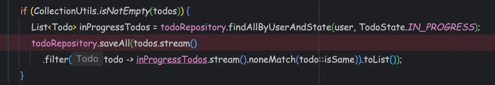
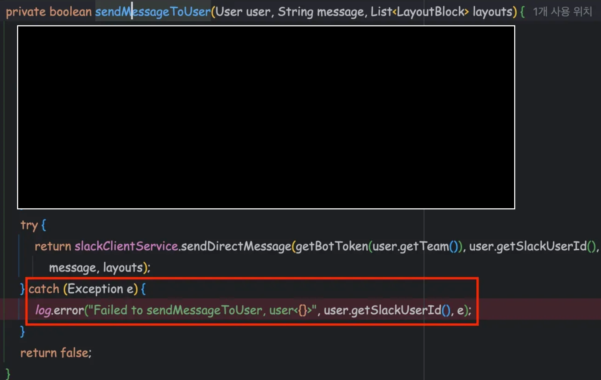
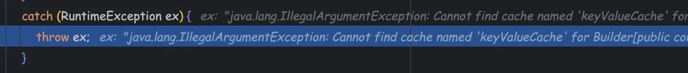
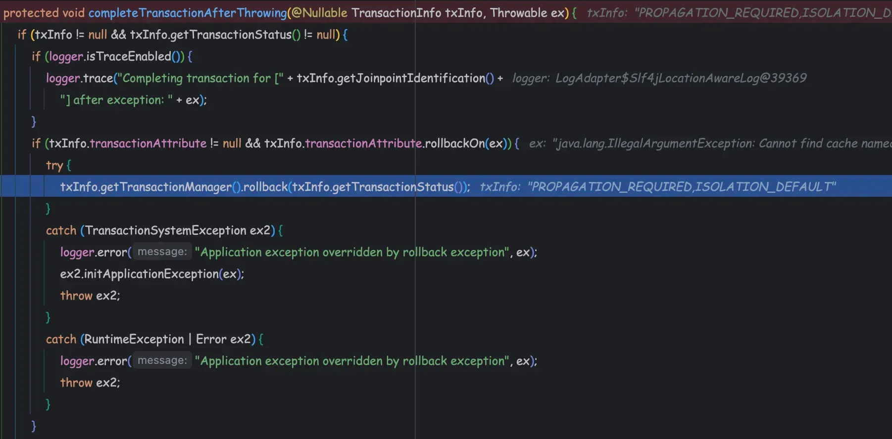
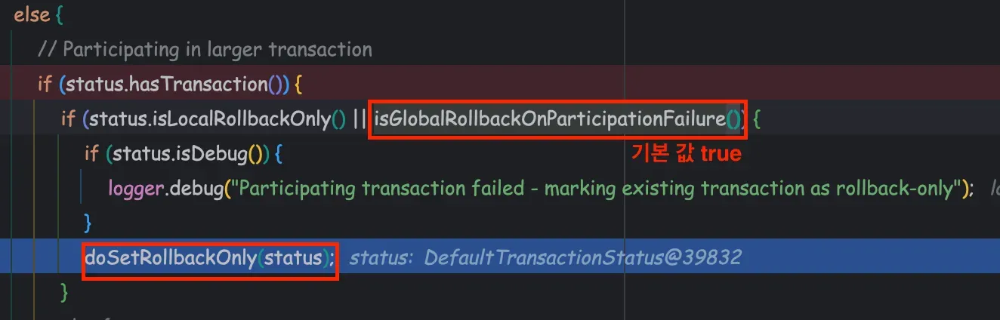
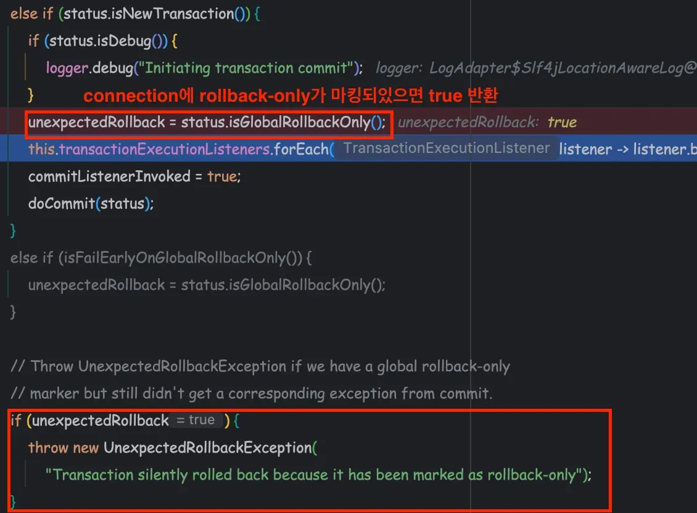

### 문제 상황

로컬 환경에서 할일 알림이 DB에 저장되지 않는 문제가 발생했습니다. 
신기하게도 DEV, PROD 환경에서는 정상적으로 동작하고 있었고, 최신 DB 스냅샷과 dev 브랜치로 업데이트해도 문제가 지속되었습니다.

### 디버깅 과정

먼저 디버거를 통해 데이터 흐름을 확인했습니다.



디버깅 결과 데이터가 정상적으로 저장되는 것을 확인할 수 있었습니다. 하지만 실제 DB에 데이터는 존재하지 않았고,
AOP 로그를 추적하던 중 다음과 같은 에러 로그를 발견했습니다.

`Transaction silently rolled back because it has been marked as rollback-only`

로컬 Kafka 설정 문제를 의심해 확인했지만 메시지는 정상적으로 컨슘되고 있었습니다. 
다른 팀원들도 동일한 현상을 겪고 있어 환경적 문제가 아닌 코드 레벨의 문제임을 의심했습니다.

### 근본 원인

문제는 `dispatchAlarm` 메서드에서 호출하는 SlackService에 있었습니다.

```java
@Transactional
public boolean sendMessageToUser(SlackMessage slackMessage) {
    User user = slackMessage.getReceiver();
    slackMessage.setSendAt(LocalDateTime.now(clock));
    return sendMessageToUser(user, slackMessage.getText(messageSource), slackMessage.getLayouts(messageSource));
}
```

SlackService에서 예외를 catch하고 false를 반환하도록 구현되어 있었다.



해당 코드는 예외를 catch하고 false를 반환하도록 구현되어 있었습니다. 
개발 의도는 "Slack 알림 실패 시에도 이메일과 할일 알림은 정상 처리되어야 한다"는 것이었습니다.


### 트랜잭션 롤백 과정

문제의 근본적인 원인은 Spring의 트랜잭션 전파 방식과 관련이 있습니다.

1. `getBotToken`에서 keyValueCache를 찾지 못해 IllegalArgumentException 발생


2. TransactionAspectSupport 클래스에서 rollback 수행


3. DataSourceTransactionManager가 Connection에 rollback-only 마킹


4. Todo 저장이 성공해도 dispatchAlarm 종료 시점에 커밋 실패


### 정리

Spring의 기본 트랜잭션 전파 방식(REQUIRED)에서는 다음과 같이 동작합니다.

1. ServiceA 트랜잭션 시작: @Transactional 어노테이션으로 새로운 트랜잭션 생성
2. ServiceB 트랜잭션 참여: REQUIRED 설정으로 기존 트랜잭션에 참여
3. ServiceB에서 RuntimeException 발생: TransactionAspectSupport가 트랜잭션을 "rollback-only"로 마킹
4. ServiceA에서 예외 처리: try-catch로 예외를 처리하지만 이미 롤백 상태로 마킹됨
5. 커밋 시도 실패: "rollback-only" 상태에서는 커밋이 불가능하여 UnexpectedRollbackException 발생

이는 Spring 트랜잭션의 핵심 원칙 중 하나입니다. 
한 번 rollback-only로 마킹된 트랜잭션은 어떤 방법으로도 커밋할 수 없습니다.

### 해결 방법

SlackService에 @Transactional(propagation = Propagation.NOT_SUPPORTED) 적용했습니다.

**선택 이유**

- Slack은 외부 API 호출로 데이터베이스 트랜잭션이 불필요
- Slack 실패가 전체 알림 프로세스(이메일, TODO 저장)에 영향을 주지 않도록 격리
- 외부 의존성으로 인한 트랜잭션 실패 방지


이번 이슈를 통해 Spring 트랜잭션의 전파 방식과 rollback-only 메커니즘에 대해 깊이 이해할 수 있었습니다.
