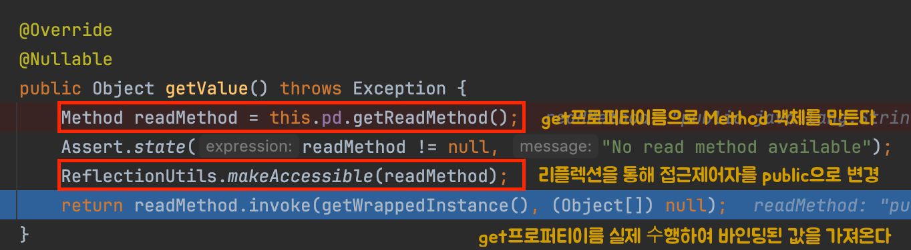

문자열 키("korName")로 객체의 프로퍼티 값을 가져와야 한다면, 어떻게 하시겠어요? 리플렉션? ObjectMapper?

이 글에서는 Spring MVC가 `@ModelAttribute`에서 사용하는 BeanWrapper를 **인사카드 시스템**에 활용한 경험을 공유합니다.

## 왜 런타임에 필드를 결정해야 했나?

**API 응답 구조의 특징**

클라이언트에 내려가는 응답은 칼럼 정보(메타데이터)와 실제 데이터가 분리된 구조입니다

```json
{
  "sections": [
    {
      "sectionKey": "BASIC",
      "columns": [
        {"columnKey": "korName", "displayName": "한글 이름"},
        {"columnKey": "engName", "displayName": "영문 이름"},
        {"columnKey": "email", "displayName": "이메일"}
      ],
      "items": [
        ["홍길동", "HONG", "hong@test.kr"] 
      ]
    }
  ]
}
```

**왜 이런 구조인가?**

인사카드 시스템은 커스텀 섹션을 지원합니다.

**기존 방식의 문제**

기존 방식은, 고객의 커스텀 요청이 있을 때, 요구사항에 맞게 제작하기 위해 다음과 같은 과정을 거칩니다.

- 고객사: "우리는 '자격증' 섹션에 '갱신 예정일' 필드를 추가해주세요"
- 개발자: CertificateDto에 renewalScheduledDate 필드 추가
- 코드 수정 → 배포 필요

문제는 개발일정이 들어가고, 앞으로도 이런 비슷한 요청이 있을때마다 개발일이 투입되는게 아깝습니다.

**새로운 방식**

- 커스텀 메타데이터를 DB 테이블로 관리
- 고객사별로 섹션/칼럼 구성을 DB에 저장
- DTO 수정 없이 메타데이터 기반으로 응답 생성

이 코드배포 과정을 아예 없애기 위해, 위처럼 진행하고, 응답 구조를 "칼럼 메타데이터 + 데이터"로 분리하여 DTO 없이도 다양한 섹션 구성을 처리하기로 했습니다.

**문제: 엔티티 → items 배열 변환**

각 섹션마다 표시할 칼럼이 DB 메타데이터로 정의됩니다

- BASIC 섹션: `["korName", "engName", "email", ...]`
- CAREER 섹션: `["companyName", "startDate", "dept", ...]`
- 커스텀 섹션: `["customField1", "customField2", ...]` ← 코드에 없는 필드


엔티티에서 칼럼 순서대로 값을 추출해야 하는데, 이렇게 칼럼 키가 런타임에 메타데이터에서 가져온 문자열 배열로만 주어집니다.

```java
// 런타임에 DB에서 조회하고 가공된 칼럼 정보
sectionColumnKeys.columnKeys = ["korName", "engName", "email"]

// 이 문자열 배열로 Basic 엔티티에서 값을 꺼내야 함
private SectionItem entityToSectionItem(Basic entity, SectionColumnKeys keys) {
    // "korName"이라는 문자열로 entity.getKorName() 값을 어떻게 가져올까?
}
```

하드코딩할 수 없는 이유

- 섹션/칼럼 구성이 DB 메타데이터로 관리됨
- 고객사마다 다른 커스텀 섹션 보유
- 배포 없이 메타데이터만 수정하여 섹션 추가/변경 가능

→ **런타임에 문자열 키로 엔티티 프로퍼티에 접근하는 방법이 필요**

---

## 해결 과정

**필요한 것**

런타임에 DB에서 가져온 문자열 키("korName")로 엔티티의 프로퍼티 값 가져오기

**첫 번째 시도: ModelMapper**

프로젝트에서 이미 사용 중인 ModelMapper로 엔티티를 Map으로 변환

```java
Map<String, Object> map = modelMapper.map(entity, Map.class);
Object value = map.get("korName");
```

결과: **값이 담기지 않음**

ModelMapper는 필드 대 필드로 매핑할 때 상대방 객체에 setKorName() 같은 Getter혹은 Setter 메서드가 있을 것을 기대합니다.
Map.class로 매핑을 시도하면 그냥 빈 HashMap 객체만 생성되고 내부 데이터는 채워지지 않는 현상이 발생합니다.

**두 번째 시도: ObjectMapper.convertValue()**

Jackson으로 변환 시도

```java
Map<String, Object> map = objectMapper.convertValue(entity, new TypeReference<>() {});
Object value = map.get("korName");
```

**결과:** 순환 참조 에러
```
Infinite recursion (StackOverflowError)
Basic["user"] -> User["team"] -> Team["users"] -> User["team"] -> ...
```

원인:

- Jackson이 엔티티 전체를 직렬화하면서 연관 엔티티까지 탐색
- JPA 양방향 연관관계로 인한 무한 루프

**검토했던 대안들**

| 방법                  | 문제점 |
|---------------------|--------|
| ObjectMapper 설정 변경  (@JsonManagedReference 등) | 전역 설정 영향, 다른 API 응답 깨질 수 있음 |
| @JsonIgnore 추가      | 엔티티 수정 필요, 다른 API 응답에 영향 |
| Hibernate5Module    | 추가 의존성 |
| 직접 리플렉션             | try-catch, setAccessible 등 보일러플레이트 |


### 최종 해결: BeanWrapper

**BeanWrapper란?**

BeanWrapper는 Spring Framework의 핵심 유틸리티로, Java Bean 규약을 따르는 객체의 프로퍼티에 문자열 키로 접근할 수 있게 해주는 래퍼 클래스입니다.
Spring MVC에서 `@ModelAttribute`가 HTTP 요청 파라미터를 객체에 바인딩할 때 내부적으로 사용됩니다

```java
// 요청: POST /users?name=John&age=30
@PostMapping("/users")
public String create(@ModelAttribute UserDto dto) {
    // Spring이 내부적으로 이렇게 처리:
    // BeanWrapper wrapper = new BeanWrapperImpl(new UserDto());
    // wrapper.setPropertyValue("name", "John");
    // wrapper.setPropertyValue("age", 30);
}
```

1. ServletRequestDataBinder.bind(): 요청 파라미터(MutablePropertyValues)를 추출합니다.
2. DataBinder.doBind(mpvs): 부모 클래스인 DataBinder로 넘어가서 실제 바인딩 로직을 수행합니다.
3. DataBinder.applyPropertyValues(mpvs): 추출된 값들을 객체에 적용하려고 합니다.
4. DataBinder.getPropertyAccessor(): 이 지점이 핵심입니다! 여기서 객체에 접근하기 위해 BeanWrapper를 생성하거나 가져옵니다.
5. AbstractPropertyAccessor.setPropertyValues(): 최종적으로 BeanWrapperImpl이 리플렉션을 사용해 setter를 호출합니다.


**적용 코드**

```java
private SectionItem entityToSectionItem(Object entity, SectionColumnKeys sectionColumnKeys) {
    BeanWrapper wrapper = new BeanWrapperImpl(entity);
    
    List<String> cellValues = sectionColumnKeys.columnKeys.stream()
        .map(key -> {
            Object value = wrapper.getPropertyValue(key);  // 문자열 키로 접근
            return value != null ? String.valueOf(value) : "";
        })
        .toList();
        
    return new SectionItem(cellValues);
}
```

`wrapper.getPropertyValue(key)` 내부적인 동작과정중 핵심로직 입니다.



BeanWrapper는 객체를 감싸서, 내부 프로퍼티에 쉽고 표준화된 방식으로 접근할 수 있게 해주는 헬퍼라 생각하면 될 것 같습니다. 

**실제 동작**

```java
// DB에서 가져온 메타데이터: ["korName", "engName", "email"]
Basic entity = new Basic("홍길동", "HONG", "hong@test.kr");
BeanWrapper wrapper = new BeanWrapperImpl(entity);

wrapper.getPropertyValue("korName");  // "홍길동" - entity.getKorName() 호출
wrapper.getPropertyValue("engName");  // "HONG"
wrapper.getPropertyValue("email");    // hong@test.kr
```

**왜 순환 참조가 발생하지 않는가?**

ObjectMapper와의 결정적 차이는 접근 범위입니다

**ObjectMapper.convertValue()**

```java
// 엔티티 전체를 Map으로 변환 시도
Map<String, Object> map = objectMapper.convertValue(entity, new TypeReference<>() {});
// → entity.getUser() 호출
//   → user.getTeam() 호출  
//     → team.getUsers() 호출
//       → 무한 루프 💥
```

**BeanWrapper.getPropertyValue()**

```java
// 요청한 프로퍼티만 접근
wrapper.getPropertyValue("korName");  // entity.getKorName()만 호출, 끝.
// → 연관 엔티티 탐색 안 함 ✅
```

BeanWrapper는 지정한 필드의 getter만 호출하고 끝나므로, JPA의 양방향 연관관계를 타고 들어가지 않습니다.


### BeanWrapper를 선택한 이유

1. Spring의 검증된 표준 방식
   - Spring MVC의 데이터 바인딩 핵심 구현체
   - @ConfigurationProperties, @ModelAttribute 등에서 이미 사용 중
   - Spring Framework 전반에서 프로퍼티 접근 표준으로 사용
2. 순환 참조 문제 해결 
   - 요청한 필드만 접근하는 선택적 프로퍼티 접근
   - JPA 연관관계 탐색 없음
3. 엔티티 수정 불필요
   - @JsonIgnore, @JsonManagedReference 등 어노테이션 추가 없이 해결
   - 다른 API 응답에 영향 없음
4. 타입 안전성과 null 처리

```text
java// null-safe 접근
Object value = wrapper.getPropertyValue("korName");  // null 가능
String stringValue = value != null ? String.valueOf(value) : "";

// 타입 변환 지원
wrapper.getPropertyValue("age");  // Integer 반환
wrapper.getPropertyValue("startDate");  // LocalDate 반환

```

**제약사항**

- getter/setter가 있어야 합니다. (Lombok @Getter로 충족)
- wrapper.getPropertyValue("user.team.name") 가능하지만, 이 경우 지연 로딩 주의 필요
- 성능: 리플렉션 기반이지만, 내부 캐싱으로 실사용에서 문제없음


## 마치며

메타데이터 기반 시스템으로 전환하면서 런타임에 필드를 결정해야 하는 과제가 생겼습니다.
ObjectMapper는 순환 참조로 실패했고, 직접 리플렉션은 보일러플레이트가 많았습니다.

BeanWrapper는 이 문제를 깔끔하게 해결했습니다
- 요청한 필드만 접근해 순환 참조 회피
- Spring이 검증한 안정적인 API
- 엔티티나 전역 설정 수정 불필요

이제 커스텀 섹션 추가 요청이 올 때마다 DTO를 만들고 배포할 필요가 없어졌습니다.

런타임에 문자열 키로 객체 프로퍼티에 접근해야 한다면,
BeanWrapper를 고려해보시기 바랍니다.

