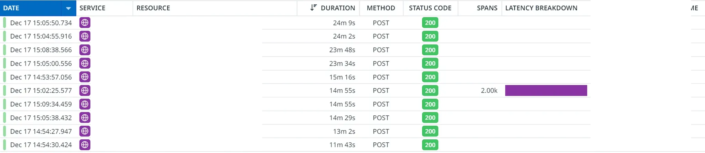
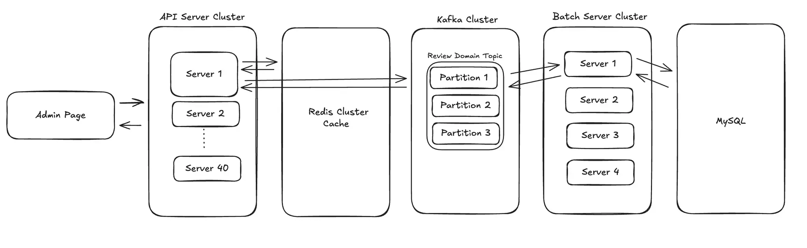

리뷰 복사 기능은 상위리뷰 데이터를 그대로 복사하는 기능으로, 데이터 양에 따라 최대 2시간 이상 소요되는 무거운 작업이에요. 이 기능을 동기 API에서 Kafka 기반 비동기 처리로 마이그레이션한 과정을 공유합니다.

---

## 왜 비동기 처리가 필요했나?

기존에는 리뷰 복사 요청이 들어오면 API 서버에서 직접 복사 작업을 수행하고, 완료될 때까지 응답을 반환하지 않았어요.

```
Client → Controller → CopyService → 완료까지 대기 (최대 2시간) → 응답
```

이 구조에는 세 가지 문제가 있었습니다.

1. **HTTP 커넥션 점유**: 복사가 완료될 때까지 최대 2시간 동안 커넥션을 점유해요.
2. **API 서버 과부하**: 복사 요청을 여러 번 누르면 서버에 과부하가 발생해요.
3. **긴 처리 시간**: 종료된 상위리뷰는 데이터가 많아서 더 오래 걸려요.

예를들어 아래는 APM에서 관측된 상황입니다.
이때, 같은 상위리뷰에 대해 중복 요청이 가서 약 10개의 커넥션을 20분간 점유하고 있었습니다.



그래서 이제 어드민 기능을 API 서버와 격리시키기위해 조치가 필요했습니다.  


---

## 어떻게 해결했나?

Kafka를 활용해 복사 요청을 비동기로 처리하도록 개편하며, 다음과 같은 아키텍처로 설계했습니다.




```
┌─────────────── API 요청 ───────────────┐

Admin Page → Controller → Redis Lock 획득 시도
                        → 실패 시: 409 Conflict
                        → 성공 시: Kafka 이벤트 발행 → 200 OK

┌─────────────── Consumer ───────────────┐

Kafka → Handler → ThreadPoolTaskExecutor → CopyService
                                        → 성공: Lock 해제
                                        → 실패 (2회 미만): Retry Topic
                                        → 실패 (2회 이상): Lock 해제 + 슬랙 알림
```

이 구조를 구현하면서 네 가지 핵심 요구사항을 충족해야 했어요.

1. **비동기 처리**: 리뷰 복사 요청을 Kafka 이벤트로 발행하고, Consumer에서 비동기 처리
2. **멱등성 보장**: 동일 리뷰에 대한 중복 요청 방지
3. **재시도 제한**: 최대 2회 재시도 (무거운 작업이므로 무한 재시도 방지)
4. **장애 복구**: 서버 종료 시에도 메시지 유실 없이 재처리

---

## 1. Redis Lock으로 멱등성 보장하기

### 왜 Redis를 선택했나?

멱등성을 보장하기 위해 락 메커니즘이 필요했어요. 선택지는 세 가지였습니다.

| 방식 | 한계 |
|------|------|
| ShedLock | 스케줄 작업용으로 설계됨. 요청 멱등성과 재시도 카운터에 부적합 |
| MySQL | TTL 구현에 별도 스케줄러 필요 |
| Redis | TTL 지원. INCR로 재시도 카운터 구현 가능 |

저희는 이미 Redis를 사용하고 있었고, TTL과 원자적 증가 연산이 필요해서 Redis를 선택했어요.

### 키 설계

키 패턴은 `review-group-copy:lock:{reviewGroupId}`로 정했어요. TTL은 8시간으로 설정했는데, 복사가 4시간 이상 걸릴 수 있어서 충분한 여유를 두었습니다.

### 재시도 횟수를 레디스에서 관리한 이유: 포이즌 필 메세지 처리

단순히 `SET mykey "1" NX` 하면 되지않을까 생각했는데 재시도 값을 추가적으로 관리한 이유가 있었습니다.

#### 문제 상황

리뷰복사를 위한 스레드 풀은 5개의 비동기 스레드로 동작합니다.
만약 무거운 상위리뷰 5개를 요청했는데 모두 하나의 파티션에 들어가고, 컨슈머가 5개를 동시 처리하다가 OOM이 발생하면 어떻게 될까요?

```
서버 복구 → 메시지 재처리 → OOM → 서버 복구 → ... 무한 반복
```

이런 메시지를 포이즌 필(Poison Pill)이라고 해요. 컨슈머가 절대로 처리할 수 없는 메시지입니다.

#### 해결책 1. pool thread를 하나로 둔다.

리뷰 복사 자체는 OOM이 날 가능성이 매우 낮고, 운영에 배치서버도 4대이니 성능이 그렇게 나빠지지는 않을 것 같습니다.

다만, OOM이 같은 서버에서 엑셀를 다운로드하는 처리 영향으로 같이 죽을 수 있기 때문에 근본적인 해결책은 아닙니다.

#### 해결책 2. KafkaHeaders.DELIVERY_ATTEMPT

`DELIVERY_ATTEMPT`는 각 레코드가 컨슈머에게 획득(acquire)될 때마다 증가하는 카운터입니다. 즉, 이 메시지가 몇 번 재시도 되었는가를 추적하는 값이죠

메시지가 무한정 재시도되는 것을 막고, 잘못된 메시지(포이즌 레코드)가 무한 루프에 빠지지 않도록 최대 횟수 제한을 둡니다.

설정방식
- `containerProperties.setDeliveryAttemptHeader(true);` 추가
- 핸들러에 `@Header(name = KafkaHeaders.DELIVERY_ATTEMPT, required = false) final Integer deliveryAttempt` 헤더값 추가

Kafka의 `KafkaHeaders.DELIVERY_ATTEMPT`를 사용하면 메시지가 몇 번 재시도되었는지 추적할 수 있어요. 
하지만 이 값은 컨슈머 인메모리에 저장되기 때문에 OOM으로 서버가 종료되면 초기화됩니다.

#### 해결책 3. Redis의 `incrementAttempt`로 재시도 횟수를 관리

여기서 떠올릴 수 있는게 Redis에 재시도 횟수 저장하면 됩니다.

```java
final long attempt = reviewGroupCopyLockRepository.incrementAttempt(event.reviewGroupId());
if (attempt > MAX_ATTEMPTS) {
    log.error("최대 시도 횟수({}) 초과, 메시지 폐기", MAX_ATTEMPTS);
    reviewGroupCopyLockRepository.release(event.reviewGroupId());
    acknowledgment.acknowledge();
    return;
}
```

서버가 재시작되어도 Redis의 값은 유지되므로 재시도 횟수를 정확히 추적할 수 있어요. 2회를 초과하면 메시지를 폐기하고 Lock을 해제합니다.


### 왜 reviewGroupId만 키로 사용했나?

처음에는 `reviewGroupId:userId`를 키로 사용하려고 했어요. 하지만 이 방식에는 문제가 있었습니다.


한 4가지 상황이 일어날 수 있는데, 1/2/3번은 어떤 키를 선택하든 그렇게 문제가 되지않습니다.

- 1번: 같은 상위리뷰에 한명의 유저가 연속 요청 시, 레디스 키에 의해 2번째 부터 계산끝날때까지 막는다.
- 2번: 한 서버에 스레드 풀이 5개로 설정하여, OOM 가능성 높음.
  - 다만, 무거운 상위리뷰 5개를 동시에 요청할 일이 거의 없음
  - 이전 방식도 톰켓 스레드로, 무제한 요청이 가능했지만 무거운 요청인 상위리뷰를 여러개 보낸 상황 X
  - 내 생각: 일단은 무시해도 괜찮다.
- 3번: 자주 벌어지는 상황
  - 보통 가벼운 복사 정도를 자주 요청하는데, 1개의 무거운 상위리뷰를 처리하는 동안 4개의 스레드가 가벼운 리뷰 처리 OK

하지만 4번은 `상위리뷰아이디:유저아이디` 키로 선택할 경우 아래 상황이 발생할 수 있고, 충분히 있을 수 있는 일입니다.

```
유저 A, B가 같은 상위리뷰에 동시 요청 → 두 요청 모두 처리 → OOM 위험
```

무거운 상위리뷰를 여러 명이 동시에 요청하면 서버에 과부하가 걸릴 수 있어요. 

반면 `reviewGroupId`만 키로 사용하면

```
유저 A가 먼저 요청 → 유저 B는 409 Conflict → A 완료 후 B 재요청 가능
```

동일 상위리뷰를 동시에 요청하는 경우는 드물고, 무거운 작업에서 동시 요청을 허용하면 OOM 위험이 높아서 이 방식을 선택했어요.

---

## 2. Manual Ack + ThreadPoolTaskExecutor 조합하기

리뷰 복사는 최대 2시간이 걸릴 수 있어요. 처리 완료 시점을 직접 제어해야 했습니다.

| 모드 | 동작 | 문제점 |
|------|------|--------|
| RECORD (기본) | 메시지 수신 즉시 ack | 처리 중 실패해도 ack → 메시지 유실 |
| MANUAL | 코드에서 직접 ack | 처리 완료 후 ack → 안전 |

### 왜 ThreadPoolTaskExecutor를 함께 사용했나?

Manual Ack만 사용하면 Kafka Consumer 스레드가 2시간 동안 블로킹돼요. Consumer 스레드가 하나뿐이라면 그 동안 다른 메시지를 처리할 수 없습니다.

```java
@KafkaHandler
public void handle(
    final ReviewGroupCopyRequestedEvent event,
    final Acknowledgment acknowledgment
) {
    final long attempt = reviewGroupCopyLockRepository.incrementAttempt(event.reviewGroupId());
    if (attempt > MAX_ATTEMPTS) {
        log.error("최대 시도 횟수({}) 초과, 메시지 폐기", MAX_ATTEMPTS);
        reviewGroupCopyLockRepository.release(event.reviewGroupId());
        acknowledgment.acknowledge();
        return;
    }

    reviewGroupCopyExecutor.execute(() -> {
        try {
            transactionTemplate.executeWithoutResult(status -> processEvent(event));
        } catch (Exception e) {
            handleFailure(event);
        } finally {
            acknowledgment.acknowledge();
        }
    });
}
```

핵심은 `reviewGroupCopyExecutor.execute()` 안에서 실제 작업을 수행하고, `finally` 블록에서 ack을 호출하는 거예요. 이렇게 하면

1. Consumer 스레드는 즉시 반환되어 다음 메시지를 받을 수 있어요.
2. 실제 복사 작업은 별도 스레드풀에서 수행돼요.
3. 작업 완료 후에만 ack이 호출돼요.

### ThreadPoolTaskExecutor 설정

```java
@Bean
public ThreadPoolTaskExecutor reviewGroupCopyExecutor() {
    final ThreadPoolTaskExecutor executor = new ThreadPoolTaskExecutor();
    executor.setCorePoolSize(5);
    executor.setMaxPoolSize(5);
    executor.setQueueCapacity(100);
    executor.setThreadNamePrefix("review-group-copy-");
    executor.setWaitForTasksToCompleteOnShutdown(true);
    executor.setAwaitTerminationSeconds(28800);  // 8시간
    executor.initialize();
    return executor;
}
```

- **corePoolSize 5**: 배치서버 4대 × 5개 = 총 20개 동시 처리 가능
- **awaitTerminationSeconds 8시간**: Graceful Shutdown 시 실행 중인 작업 완료 대기

무거운 상위리뷰의 리소스 사용량을 측정해보니 대략 CPU 10%, 힙 1400MB를 사용했어요. 5개 스레드로 동시 처리해도 충분히 감당할 수 있는 수준입니다.

---

### Retry Topic 직접 관리하기

Spring Kafka의 `@RetryableTopic`을 사용하면 편리하지만, 기본 설정이 1000번 재시도예요. 무거운 작업에는 적합하지 않았습니다.

그래서 직접 Retry Topic을 발행하는 방식을 선택했어요.

```java
private void handleFailure(final ReviewGroupCopyRequestedEvent event) {
    publishToRetryTopic(event);
}

private void publishToRetryTopic(final ReviewGroupCopyRequestedEvent event) {
    ProducerRecord<String, ReviewGroupCopyRequestedEvent> record =
        new ProducerRecord<>(REVIEW_GROUP_COPY_EVENT_TOPIC + RETRY_TOPIC_SUFFIX,
            null, event.getPartitionKey(), event);

    reviewGroupCopyEventKafkaTemplate.send(record)
        .whenComplete((result, ex) -> {
            if (ex != null) {
                log.error("Retry 토픽 발행 실패");
                reviewGroupCopyLockRepository.release(event.reviewGroupId());
            }
        });
}
```

실패 시 Retry Topic으로 메시지를 발행하고, Consumer가 같은 토픽을 구독하도록 설정했습니다.

---

## 3. 전용 토픽 생성하기

기존 ReviewDomain Topic을 사용하지 않고 리뷰 복사 전용 토픽을 새롭게 만들었어요. 

그래야 하는 이유가 있었습니다.

### 병렬 처리 시 offset 유실 문제

ThreadPoolTaskExecutor로 병렬 처리할 때 심각한 문제가 있었어요.

```
파티션 0: [offset 100, offset 101]

// 병렬 처리 시작
스레드1: offset 100 처리 중... (느림, 5초 소요)
스레드2: offset 101 처리 완료 → acknowledge() → offset 102로 커밋 ✅

// 이 시점에 컨슈머 다운 💥

// 재시작 시
컨슈머: offset 102부터 읽기 시작
→ offset 100 메시지는 영원히 처리 안됨
```

offset 101이 먼저 완료되어 offset 102로 커밋된 상태에서 컨슈머가 다운되면, offset 100은 영원히 처리되지 않아요.

### 해결 방안 검토

이 문제를 해결하기 위해 여러 방안을 검토했어요.

**1. auto.offset.reset 설정**

```
파티션: [offset 0, 1, 2, 3, 4, 5, 6, 7, 8, 9]
                                          ↑ latest: 여기서부터 읽기 시작
```

- **earliest**: 가장 오래된 것부터 읽음 → 중복 생성 위험
- **latest**: 가장 최신부터 읽음 → 유실 가능하지만 중복 없음

리뷰 복사는 중복 생성보다 유실이 나은 케이스예요. 유실되면 사용자가 재요청하면 되니까요. **latest**를 선택했습니다.

**2. 아웃박스 패턴**

DB에 상태를 저장해놓고, 별도의 프로세스(폴링 또는 CDC)가 아웃박스 테이블에서 이벤트를 읽어 브로커에 전송하는 방식도 있어요. 하지만 리뷰 복사 기능 하나를 위해 이 정도의 복잡도를 추가할 이유가 없었습니다.

**3. 전용 토픽으로 격리**

결국 전용 토픽을 생성하기로 했어요. 리뷰 복사 메시지의 offset 유실이 점수 계산 등 다른 메시지에 영향을 주면 안 되니까요.

```java
public static final String REVIEW_GROUP_COPY_EVENT_TOPIC = "review-group-copy-events";

@Bean
public NewTopic reviewGroupCopyTopic() {
    return TopicBuilder.name(REVIEW_GROUP_COPY_EVENT_TOPIC)
        .partitions(partitions)
        .replicas(REPLICATION_FACTOR)
        .configs(config)
        .build();
}
```

### 롤링 배포나 리밸런싱 시에는 문제없나?

지금까지 롤링 배포나 리밸런싱에서 offset 유실 문제가 발생하지 않았어요. 그 이유는:

**1. Graceful Shutdown 보호**

```java
executor.setWaitForTasksToCompleteOnShutdown(true);
executor.setAwaitTerminationSeconds(28800);  // 8시간
```

롤링 배포 시 SIGTERM이 오면 스레드풀 작업 완료를 대기하고, ack 후 종료해요.

**2. 리밸런싱 시 보호**

Spring Kafka는 리밸런싱 전에 ConsumerRebalanceListener가 호출되어 pending 작업을 정리하려고 시도합니다.

**3. 낮은 사용 빈도**

리뷰 그룹 복사는 자주 사용되는 기능이 아니에요. 동시에 여러 요청이 들어오는 경우도 드물고, 배포 시점에 마침 처리 중인 경우도 드뭅니다.

**문제가 발생하는 케이스**

- 강제 종료 (kill -9, OOM kill)
- Pod 강제 종료 (리소스 부족으로 즉시 종료)
- 네트워크 단절 후 복구

이런 경우에는 메시지가 유실될 수 있지만, 사용자가 재요청하면 되므로 크게 문제되지 않는다고 판단했어요.

---

## 마치며

| 항목 | 선택 | 이유 |
|------|------|------|
| 비동기 처리 | Kafka | API 서버 부하 감소, 장애 복구 용이 |
| 멱등성 | Redis Lock | TTL 지원, INCR로 재시도 카운터 겸용 |
| 메시지 유실 방지 | Manual Ack + ThreadPoolTaskExecutor | Consumer 스레드 블로킹 방지하면서 완료 시점 제어 |
| 포이즌 필 처리 | Redis 재시도 카운터 | 서버 재시작에도 추적 가능 |
| 토픽 | 전용 토픽 | 다른 메시지 처리에 영향 격리 |
| offset 정책 | latest | 중복 생성보다 유실 허용 (재요청 가능) |

동기 API를 비동기로 전환할 때는 멱등성, 메시지 유실 방지, 포이즌 필 처리를 고려해야 해요. 특히 무거운 작업일수록 재시도 횟수 제한과 장애 복구 전략이 중요하다고 생각합니다.
